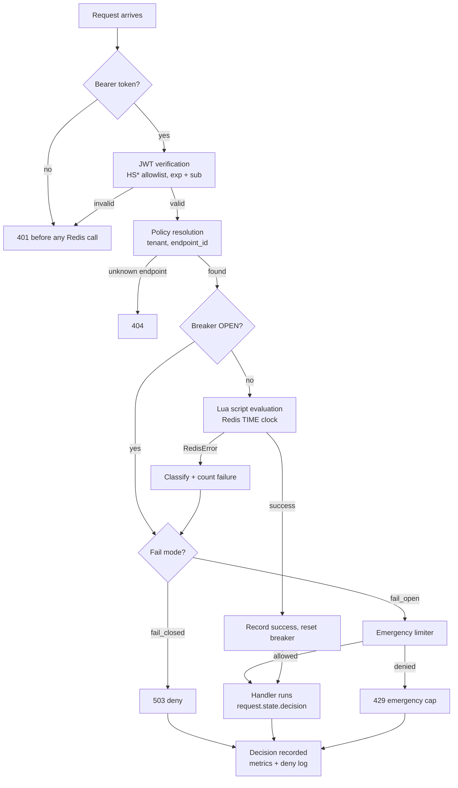
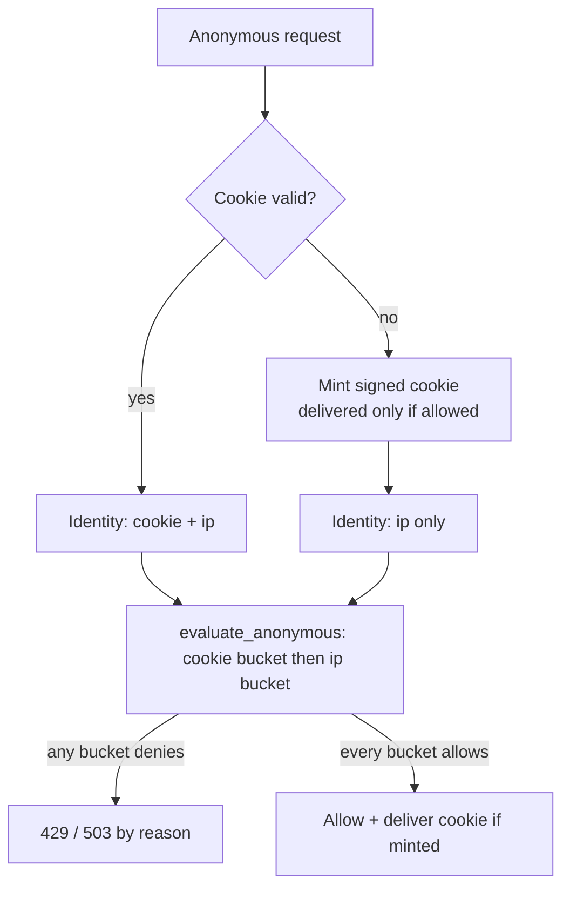

# Sentinel — Architecture

*Phase 15 documentation deliverable. The frozen V1 specification lives in
`docs/sentinel-project-record.md`; this document is the implementer-facing walkthrough of the
shipped code — module map, request journey, state design, clock discipline, and invariants.*

Sentinel is an application-layer, tenant-aware, distributed rate limiter packaged as an
in-process Python library for FastAPI. It is backed by a single dedicated Redis instance and
enforces per-tenant, per-endpoint quotas with atomic Lua scripts. This document describes how
the pieces in `sentinel/` fit together and why they are shaped the way they are.

---

## 1 · Module map

| Module | Responsibility | Key types / entry points |
|---|---|---|
| `sentinel/models.py` | Domain contracts | `Policy` (frozen, `extra="forbid"`, Lua-exactness bounds, `identity: IdentityMode`), `Decision`, `DecisionReason` (8 members), `AlgorithmType`, `FailMode`, `IdentityMode` (`TENANT_JWT` / `ANONYMOUS`) |
| `sentinel/config.py` | Strict static config loading | `SentinelConfig`, `AppConfig` (JWT secret + HS* allowlist, anonymous cookie settings), `load_config(path)` |
| `sentinel/resolver.py` | Policy lookup | `StaticPolicyResolver.resolve(tenant_id, endpoint_id) -> Policy \| None`, `resolve_anonymous(endpoint_id) -> Policy \| None` |
| `sentinel/redis.py` | Redis foundation | `SentinelRedis` (pool, 20 ms fail-fast budget, `assert_noeviction()`), `ScriptLoader` (load / execute, NOSCRIPT → re-load once) |
| `sentinel/lua.py` | Script registry | `TOKEN_BUCKET_SCRIPT`, `SLIDING_WINDOW_SCRIPT`, `script_source(name)`, `load_scripts(loader)` |
| `sentinel/lua/*.lua` | Atomic algorithms | `token_bucket.lua`, `sliding_window.lua` |
| `sentinel/algorithms.py` | Pure Python references | `token_bucket_evaluate`, `sliding_window_evaluate`, `TOKENS_PER_TOKEN_MICRO = 1_000_000` |
| `sentinel/limiter.py` | Orchestration | `RateLimiter.evaluate(policy, key)`, `RateLimiter.evaluate_anonymous(policy, keys)`, `TokenBucketStrategy`, `SlidingWindowStrategy`, `build_bucket_key`, `build_anonymous_key`, `hash_tenant` |
| `sentinel/anonymous.py` | Anonymous identity (Phase 19) | `mint_cookie`, `parse_cookie`, `client_ip`, `anonymous_cookie_identity`, `anonymous_ip_identity`, `hash_identity` |
| `sentinel/errors.py` | Failure classification | `classify_redis_error(exc) -> DecisionReason`, `ScriptMissingError` |
| `sentinel/circuit_breaker.py` | Per-process breaker | `CircuitBreaker` (CLOSED / OPEN / HALF_OPEN, threshold 5, 30 s quarantine) |
| `sentinel/emergency.py` | Fail-open cap | `TokenBucketEmergencyLimiter`, `EmergencyOutcome`, `EmergencyLimiter` protocol |
| `sentinel/auth.py` | JWT verification | `verify_bearer_token(token, secret, algorithms) -> sub`, `AuthenticationError`, `AuthReason` |
| `sentinel/http.py` | FastAPI integration | `SentinelGuard`, `guard_for(endpoint_id)` / `anonymous_guard_for(endpoint_id)` dependencies |
| `sentinel/observability.py` | Logs + metrics | `SentinelObservability.record_decision(...)` |

The module boundaries mirror the six-stage request pipeline of the spec (project record §03):
**auth → policy resolution → rate limiting → failure/resiliency → observability**, with the
HTTP guard as the only FastAPI-aware layer.

---

## 2 · The request journey

What happens for one request to a guarded endpoint (`SentinelGuard.guard_for`,
`sentinel/http.py:101`):

1. **Bearer token extraction** (`sentinel/http.py:63`). The `Authorization` header must be a
   non-empty `Bearer <token>`; anything else raises 401 with `WWW-Authenticate: Bearer` before
   any Redis call. The `X-Tenant-ID` header is never read — tenant identity comes only from a
   validated JWT `sub` claim.
2. **JWT verification** (`sentinel/auth.py:35`). PyJWT decodes with the configured allowlist
   (`HS256/384/512` only, `sentinel/config.py:10`) and requires both `exp` and `sub`. Failures
   map to `AuthReason` and become 401; they never produce a `DecisionReason` (invariant #4).
3. **Policy resolution** (`sentinel/resolver.py:29`). `(tenant_id, endpoint_id)` → `Policy` or
   `None`. `endpoint_id` is always the explicit configured id passed to `guard_for(...)`, never
   derived from the URL/path (ADR-009). Unknown endpoint → 404.
4. **Script readiness** (`sentinel/http.py:117`). `await guard.load_scripts()` must have run at
   startup; otherwise a `RuntimeError` is raised (programming error, never caught).
5. **Bucket key** (`sentinel/limiter.py:41`):
   `sentinel:v1:{sha256(tenant_id)}:{endpoint_id}:{policy_version}`. The tenant is hashed, so
   raw tenant ids never appear in Redis keys, logs, or metrics.
6. **Evaluation** (`RateLimiter.evaluate`, `sentinel/limiter.py:142`):
   - If the circuit breaker is OPEN, short-circuit before Redis: fail-closed → `CIRCUIT_OPEN`;
     fail-open → emergency limiter (`sentinel/limiter.py:143`).
   - Otherwise dispatch to the algorithm strategy, which runs the Lua script via `ScriptLoader`
     (`sentinel/lua/*.lua`).
   - On `RedisError`: count the failure on the breaker, classify it (`sentinel/errors.py:14`),
     then branch on `fail_mode` — fail-closed → `FAIL_CLOSED`; fail-open → emergency limiter
     (`sentinel/limiter.py:147`).
   - On genuine Redis success: `breaker.record_success()` — only real successes reset the
     breaker.
7. **Decision → HTTP** (`sentinel/http.py:134`). Allowed → the handler runs (`decision` is
   attached to `request.state.decision`). Denied → 429 (`RATE_LIMITED`,
   `EMERGENCY_LOCAL_LIMIT`, with `Retry-After` when available) or 503 (the five store-failure
   reasons) per `_denied_status` (`sentinel/http.py:47`).
8. **Observability** (`sentinel/observability.py:59`). Every decision increments
   `sentinel_decisions_total` and `sentinel_evaluate_latency_microseconds`, labeled only by
   `endpoint_id`/`decision_reason`; every denial emits a WARNING structured log carrying
   `tenant_hash` (never the raw tenant), `endpoint_id`, `decision_reason`, `latency_micro`,
   `breaker_state`.

### Anonymous requests (Phase 19)

Unauthenticated endpoints (`auth.login`, `auth.signup`, `auth.reset`) have no JWT `sub` to key
on. They are guarded through `SentinelGuard.anonymous_guard_for(endpoint_id)`
(`sentinel/http.py:172`), which shares every mechanism of the tenant journey — breaker,
emergency limiter, observability, 429/503 mapping — but derives identity differently:

1. **Cookie read** (`sentinel/anonymous.py:51`). The configured `anonymous_cookie_name` cookie
   (default `sentinel_anon_id`) is parsed and verified: format
   `<client_id>.<exp_epoch>.<hmac_hex>`, `client_id` = 32 hex chars (16 CSRNG bytes), MAC =
   `HMAC-SHA256(anonymous_cookie_secret, "sentinel-anon:v1:{client_id}:{exp}")`. Tampered,
   malformed, or expired cookies are treated as *missing* (all-or-nothing, `parse_cookie`
   returns `None`).
2. **Minting** (`sentinel/anonymous.py:84`). When no valid cookie is present, a fresh id is
   minted and signed. The cookie is delivered via FastAPI `Response` injection as
   `HttpOnly; SameSite=lax; Secure` (configurable), with `Max-Age` from
   `anonymous_cookie_ttl_seconds`. **A denied request never receives the cookie**
   (SEC-ANON-06): flooders without cookies stay bounded by the IP bucket.
3. **Client IP** (`sentinel/anonymous.py:110`). `request.client.host` — the socket peer as
   resolved by the ASGI server's trusted-proxy layer. The library never reads
   `X-Forwarded-For`/`X-Real-IP`/`CF-Connecting-IP` (SEC-ANON-01): raw header values are the
   one thing a client fully controls. Missing or non-IP peers collapse to a single `unknown`
   bucket (over-blocking, never quota bypass); private/loopback peers warn.
4. **Dual-bucket evaluation** (`RateLimiter.evaluate_anonymous`, `sentinel/limiter.py:190`).
   With a valid cookie: keys `[cookie, ip]`; without: `[ip]` only. The decision is ALLOWED
   only if every bucket allows (AND semantics); the first denial wins and no further key is
   evaluated. Store-failure outcomes (`REDIS_*`, `CIRCUIT_OPEN`, `FAIL_CLOSED`,
   `EMERGENCY_LOCAL_LIMIT`) are terminal: they reflect Redis health, not a per-key quota, and
   re-evaluating would double-consume the per-process emergency limiter on the fail-open path.
5. **Identity hygiene**. Bucket identities are `anon:cookie:{client_id}` / `anon:ip:{ip}` and
   are sha256-hashed by `build_anonymous_key` into the separate `sentinel:v2:` keyspace
   (invariant #4's hygiene extended to anonymous identity). The deny log carries
   `identity_mode` + `identity_hash` of the *primary* identity (cookie when present, else IP);
   raw client ids and IPs never reach keys, logs, or metrics (SEC-ANON-03).

---

## 3 · State & key design

Both Lua scripts store their state in a single Redis string per bucket, read with `GET` and
written with `SET` + `EXPIRE` — never `DEL`, never `KEYS`/`SCAN`, never eviction (SEC-02,
ADR-004/005).

| Algorithm | State format | Expiry |
|---|---|---|
| Token bucket | `tokens_micro:last_refill_micro` (epoch-microsecond integers) | On allow with `rate > 0`: `ttl = ceil((capacity - tokens) / rate) + 1` s — the key lives until the bucket would be full again, then expires (full bucket = no useful history) |
| Sliding window | `current_count:previous_count:window_start_micro` | `ttl = ceil(2 * window_size / 1s)` — two windows, the rollover horizon, so expiry is lossless |

Both scripts format timestamps with `%.0f` so epoch-microsecond values stay in decimal form
(scientific notation would corrupt the state on the next read).

**Denied requests never write** (invariant enforced in both scripts, `token_bucket.lua:8`,
`sliding_window.lua:11`): a denied evaluation returns without touching the key or its TTL. The
same contract applies to the emergency limiter (`sentinel/emergency.py:70`) — this is the
Phase 14 double-refill fix.

**Lua integer exactness.** Lua 5.1 numbers are IEEE doubles; arithmetic is exact only below
2^53. `Policy` validation therefore bounds every intermediate product (`LUA_MAX_EXACT_INT =
2^52`, `TOKEN_BUCKET_MAX_CAPACITY_MICRO = TOKEN_BUCKET_MAX_RATE = 2^30`,
`sentinel/models.py:17`), rejecting configurations whose arithmetic would leave the exactness
envelope.

**Keyspaces.** Tenant buckets live in `sentinel:v1:{sha256(tenant)}:{endpoint_id}:{policy_version}`.
Anonymous buckets (Phase 19) live in the separate `sentinel:v2:{sha256(identity)}:{endpoint_id}:{policy_version}`
address space — the `v2` prefix guarantees an anonymous bucket can never collide with a tenant
bucket even for identical raw values. Both namespaces share the Lua scripts, state format, and
no-write-on-deny contract; only the identity derivation differs.

---

## 4 · Clock discipline

Three clocks exist in the system, and they never mix:

| Clock | Used by | Why |
|---|---|---|
| Redis `TIME()` | Both Lua scripts, exclusively | The distributed invariant: every API instance agrees on one clock, so buckets stay consistent across processes (`invariant #1`) |
| Python wall clock (`time.time_ns()`) | `Decision.decision_time_micro` (observability timestamp only, `sentinel/limiter.py:84`) | Metadata for log/metrics correlation; never enters a Lua script or the algorithm math |
| Local monotonic clock (`time.monotonic*`) | Circuit breaker (`sentinel/circuit_breaker.py:29`) and emergency limiter (`sentinel/emergency.py:42`) | Both operate precisely when Redis is unreachable; monotonic time is the only sane clock there — documented exceptions to invariant #1 |

---

## 5 · Atomicity & concurrency

Correctness under concurrency comes from three layers:

1. **Lua atomicity** — each evaluation is one script execution; Redis runs scripts
   single-threaded, so concurrent requests cannot interleave read-modify-write.
2. **Reference parity** — the Lua scripts mirror the pure Python functions in
   `sentinel/algorithms.py` exactly for every reachable state; `tests/test_lua_parity.py`
   (25 tests) compares real Redis output against the reference across generated traffic
   patterns.
3. **Failure isolation** — the breaker + emergency limiter (see
   [failure-handling.md](failure-handling.md)) keep a Redis outage from becoming an unbounded allowance or a
   request-hang. Only genuine Redis successes reset the breaker's failure count.

Proven under load: exact token-bucket capacity across 50 racing coroutines and across 3 spawned
processes; sliding-window admission never exceeds the sequential reference bound; breaker trips
OPEN under real dead-port injection; the emergency limiter caps fail-open traffic at the
configured per-process fallback rate (Phase 13).

---

## 6 · Configuration surface

`SentinelConfig` (`sentinel/config.py:34`) is strict: frozen, `extra="forbid"`, policy dict keys
must match `Policy.endpoint_id`. `AppConfig` (`sentinel/config.py:13`) holds deployment-level
settings — `redis_url`, `jwt_secret` (min 32 chars), `jwt_algorithm_allowlist` (non-empty
subset of HS256/384/512; asymmetric/JWKS rejected at load). See `sentinel.example.json` and the
README for a full example.

`Policy` (`sentinel/models.py:45`) validates per-algorithm: token bucket requires
`capacity_micro` + `refill_rate_micro_per_sec`; sliding window requires `limit` and rejects the
bucket fields; both enforce the Lua-exactness bounds above and the `endpoint_id` pattern
`^[a-z0-9._-]+$`. `Policy.identity` (`IdentityMode`, Phase 19) defaults to `TENANT_JWT` for
backward compatibility; an `ANONYMOUS` policy additionally requires
`app.anonymous_cookie_secret` at load time (rejected otherwise).

---

## 7 · Invariants (non-negotiable)

The frozen spec (project record) holds these eight as absolute:

1. Redis `TIME()` is the only clock in the rate-limiting scripts.
2. Integer microtokens only — no floats in state.
3. Key format `sentinel:v1:{sha256(tenant_id)}:{endpoint_id}:{policy_version}`; `endpoint_id`
   always an explicit configured id.
4. Tenant identity only from a validated JWT `sub`; auth failures are 401 before any Redis
   call and never produce a `DecisionReason`.
5. No client-reachable numeric input — no `cost` parameter; the only ARGV values are
   server-side policy parameters.
6. Time-source testing: no-refill tests use `refill_rate=0`; refill tests use short real
   durations; never dual Lua scripts for testing.
7. Sliding window formula
   `estimated = current + previous × (remaining / window_size)`, evaluated against Redis
   `TIME()` `now` and anchored to it.
8. Lua product bounds enforced in `Policy` validation.

**Phase 19 additions (anonymous identity).** Extends — never weakens — the above:

9. `sentinel:v2:` anonymous keys hash identity strings (`anon:cookie:*` / `anon:ip:*`) with
   the same sha256 hygiene as tenant ids; raw ids/IPs never reach keys, logs, or metrics.
10. `request.client` (ASGI-server-resolved peer) is the only IP source — forwarding headers
    are never read.
11. Anonymous decisions are ALLOWED only if every bucket allows; denied requests never write
    and never receive a minted cookie.
12. `anonymous_cookie_secret` is required iff any anonymous policy exists; the cookie is
    HMAC-signed (tamper/expiry rejection) and all-or-nothing on parse.

---

## 8 · Where each guarantee is proven

| Guarantee | Evidence |
|---|---|
| Exact token-bucket capacity | `tests/test_concurrency.py`, `tests/test_concurrency_multiprocess.py`, `tests/test_limiter_integration.py` |
| Sliding-window reference bound | `tests/test_lua_parity.py`, `tests/test_algorithms.py`, `tests/test_algorithms_properties.py` |
| Identity / spoofing | `tests/test_security.py` (SEC-03, SEC-08, SEC-ANON-01/02/03), `tests/test_http.py` |
| Anonymous guard semantics | `tests/test_http_anonymous.py`, `tests/test_anonymous_integration.py`, `tests/test_anonymous.py` |
| Anonymous dual-bucket concurrency | `tests/test_concurrency.py` (conc-30/31) |
| Failure semantics | `tests/test_errors.py`, `tests/test_circuit_breaker.py`, `tests/test_emergency.py`, `tests/test_limiter.py` |
| Noeviction startup check | `tests/test_redis.py` (`security`-marked) |
| Overhead + failure-path latency | `docs/benchmark-results.md` (Phase 14 baseline, disclosed as-is) |

---

## 9 · Related documents

- [sentinel-project-record.md](sentinel-project-record.md) — canonical frozen V1 spec (problem, reviews, ADRs, §06
  failure table, §07 security findings, §09 testing).
- [failure-handling.md](failure-handling.md) — the resiliency triangle in depth (classification, breaker,
  emergency limiter, HTTP semantics, failure-path measurements).
- [known-limitations.md](known-limitations.md) — every accepted V1 limitation and its ADR/source.
- [Home](index.md) — entry point: install, config, FastAPI wiring, quick reference.
