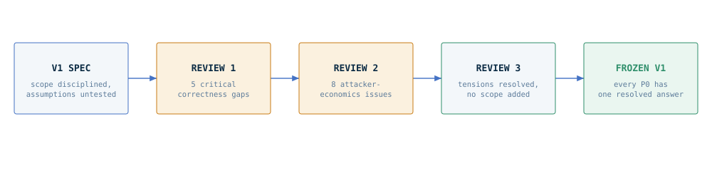
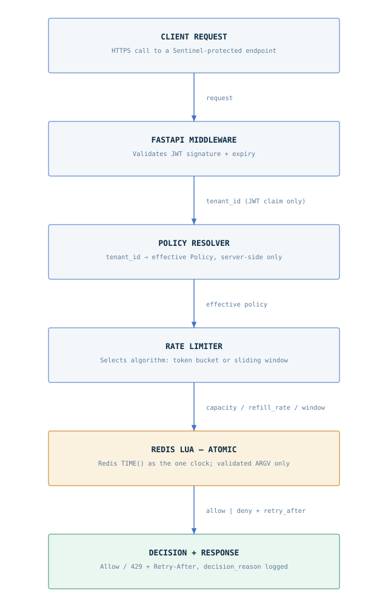
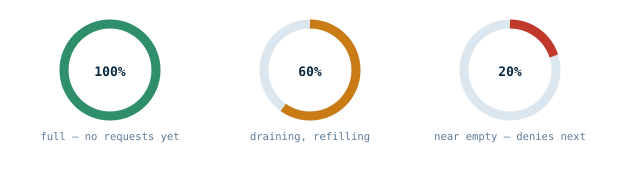
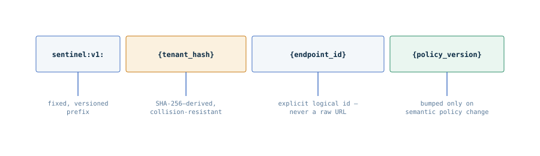
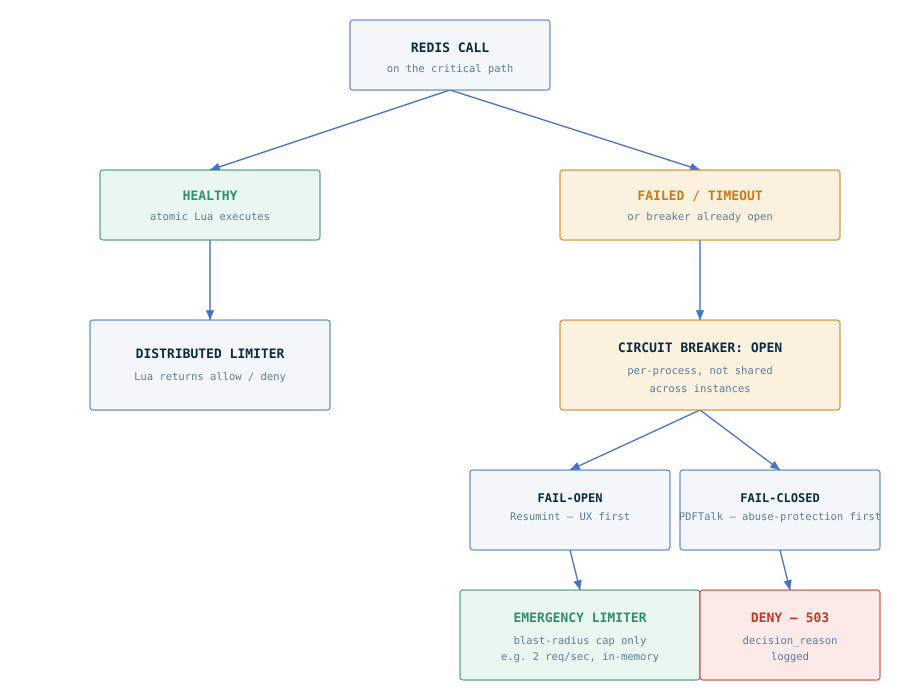
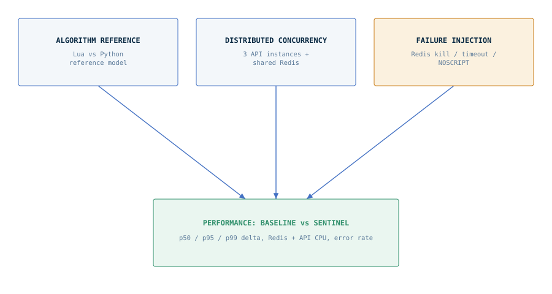

# SENTINEL — Project Record

*Distributed Rate Limiter — Full Project Record*

Application-layer rate limiting for multi-tenant APIs, built on FastAPI and Redis. This document is the complete record: the problem, three rounds of adversarial review, the architecture, and the frozen V1 specification — everything needed to understand the project without reading anything else.

**Feasibility: 8.5–9 / 10**  ·  **Status: V1 spec frozen**  ·  **Stack: FastAPI · Redis · Lua**

---

## Contents

1. [The Problem](#01-the-problem)
2. [Approach](#02-approach)
3. [Architecture](#03-architecture)
4. [Algorithms](#04-algorithms)
5. [State & Key Design](#05-state--key-design)
6. [Failure Handling](#06-failure-handling)
7. [Security Hardening](#07-security-hardening)
8. [Integrations](#08-integrations)
9. [Testing & Benchmarking](#09-testing--benchmarking)
10. [Deferred to V2](#10-deferred-to-v2)
11. [Status & Next Steps](#11-status--next-steps)

---

## 01 · The Problem

Edge and CDN rate limiting stops blunt volumetric abuse — too many requests from one IP, one connection. It doesn't know that one endpoint costs ten times more to serve than another, that one tenant is on a trial plan and another is paying for guaranteed throughput, or that a request just got rejected because a Redis node blinked, not because anyone did anything wrong.

Sentinel sits one layer up: an application-layer limiter that understands tenants, endpoints, and policies — not just IP addresses. It's a small FastAPI + Redis library, consumed by two real applications with different traffic shapes and different tolerance for downtime: **PDFTalk**, a document-ingestion service, and **Resumint**, an AI-assisted resume tool.

The interesting part was never the algorithm on a whiteboard — token buckets and sliding windows are textbook. The hard part is making either of them *correct* across N stateless API instances that all share one Redis as the single source of truth, while the clock, the network, and Redis itself can each fail independently, and while someone is actively looking for the seam between "the limiter said no" and "the state actually changed."

> This document is about that second problem — not "how do you rate limit," but "how do you rate limit correctly, under failure, when someone is trying to break it."

---

## 02 · Approach

The spec didn't go from whiteboard to code. It went through three review passes, each one explicitly trying to break the previous version rather than approve it — followed by a resolution pass that turned every open flag into one decision.


*FIG. 1 — spec hardening across four review stages*

**V1 spec.** Strong scope discipline (no Kafka, no Kubernetes, no Redis Cluster, no dynamic policy) and a sound FastAPI + Redis + Lua architecture — but it implicitly trusted application clocks, stated an approximate algorithm's behavior as exact, and left Redis-failure semantics undefined.

**Review 1 — correctness pass.** Found that the design's claims outran what the implementation could actually guarantee: clock skew across instances could break the token bucket, the sliding-window counter's "no boundary-burst exploit" claim wasn't strictly true, the concurrency test (`allowed == limit`) couldn't work for either algorithm, Redis timeout semantics were undefined, and the memory estimate was optimistic.

**Review 2 — attacker-economics pass.** Reframed the goal from *correct under normal operation* to *boring under adversarial and degraded operation*. Found that unvalidated Lua inputs could mint free tokens, that a shared Redis with LRU eviction could reset quotas for free, and that tenant-identity and circuit-breaker seams were exploitable.

**Review 3 — resolution pass.** Treated Review 2 as the new baseline and closed every remaining open question to a single decision, while explicitly refusing to let the review cycle keep adding scope: `cost` dropped from V1 entirely, the emergency limiter stays deliberately dumb, and the time-source testing problem got solved without forking the production script.

> **Result:** A frozen V1 spec where every P0 item has one resolved answer — not a flagged concern.

---

## 03 · Architecture

One request, six stages. Each stage is independently testable — the Policy Resolver doesn't need a live Redis to test, and the Rate Limiter doesn't need a live FastAPI app.


*FIG. 2 — the six-stage request pipeline*

The three middle stages are deliberately separate objects: **PolicyResolver** (tenant → policy), **RateLimiter** (algorithm selection and invocation), and the FastAPI middleware that wires them together. Each is unit-testable without the others — the resolver against a mock config source, the limiter against a real or fake Redis, the middleware against both as black boxes.

---

## 04 · Algorithms

### Token bucket

State is stored as **integer microtokens** (`tokens_micro`, `rate_micro`), not floats — this removes float-drift ambiguity from the correctness tests at effectively zero implementation cost. Time comes from `redis.call("TIME")` inside the Lua script, always, which is what makes the bucket consistent across every API instance regardless of each instance's own clock.


*FIG. 3 — token bucket fill states*

> **Invariant:** Accepted requests can never consume more tokens than the bucket contained at the decision timestamp.

### Sliding window counter

Instead of the vague claim "smoother than fixed window, no boundary-burst exploit," the counter is defined by one formula and tested against it directly:

```
estimated_count = current_count + previous_count × (remaining_window / window_size)
```

> **Invariant:** The implementation exactly matches this reference formula, verified against a Python reference model across many generated traffic patterns — not asserted as a fixed error percentage, since the real bound depends on traffic shape and was never derived analytically.

---

## 05 · State & Key Design

One key format, kept deliberately boring:


*FIG. 4 — `sentinel:v1:{tenant_hash}:{endpoint_id}:{policy_version}`*

**No hash tags, no per-tenant hash consolidation, in V1.** Both ideas are real — hash tags would future-proof a move to Redis Cluster, and consolidating a tenant's keys into one Redis hash would cut per-key overhead — but neither is worth adopting on theory. Benchmark the simple per-key format at 100K / 1M / 5M tenants first; treat consolidation as a documented follow-up if memory actually becomes a constraint, not a day-one assumption.

**No `cost` parameter in V1.** Nothing in the current scope needs per-request weighted cost, and any client-reachable numeric input is attack surface — this is exactly how the negative-cost token-minting issue happened in review. The Lua script's only inputs are the key components above plus algorithm parameters resolved server-side from `Policy`, never from the request itself.

---

## 06 · Failure Handling

Fail-open never means unlimited, and fail-closed is a documented tradeoff, not an accident.


*FIG. 5 — Redis failure decision tree*

| Redis outcome | Fail-open (Resumint) | Fail-closed (PDFTalk) |
|---|---|---|
| Success | Use Lua result | Use Lua result |
| Timeout (20ms) | Emergency local limiter | Deny, HTTP 503 |
| Connection error | Emergency local limiter | Deny, HTTP 503 |
| `NOSCRIPT` | Re-EVAL once, then treat as timeout | Re-EVAL once, then treat as timeout |
| Circuit breaker OPEN | Emergency local limiter | Deny, HTTP 503 |

Every row logs a bounded `decision_reason` enum — the difference between an answerable incident review and log forensics.

> **Not idempotent.** A Redis call can time out locally while the script still commits server-side. A client retry after a timeout may consume additional quota beyond what the client believes it used. Documented as a known property, not solved — solving it means idempotency keys, out of scope for V1.

> **Deliberate tradeoff.** For PDFTalk, a Redis outage means PDFTalk is unavailable. Sentinel prioritizes abuse protection over availability for expensive compute during loss of the rate-limit store — same honesty as "Redis remains a single point of correctness," stated explicitly rather than left implied.

---

## 07 · Security Hardening

Everything below was found in review, not assumed away.

| Attack / risk | Found in | Resolution |
|---|---|---|
| Negative-cost token minting | Review 2 | `cost` removed from V1 entirely — no client-reachable numeric input |
| Eviction-as-bypass (free quota reset) | Review 2 | Dedicated Redis, `noeviction`, TTL-only expiry |
| Tenant identity spoofing via headers | Review 2 | Tenant id from validated JWT claim only, no header fallback anywhere |
| JWT replay | Review 2 | Named as accepted threat; mitigation lives upstream (short-lived tokens, mTLS) |
| Circuit-breaker instance targeting | Review 2 / 3 | Breaker stays per-process; damage capped by emergency limiter regardless of instance hit |
| Redis Cluster migration cost | Review 2 | Deliberately deferred to V2 — not fixed now, decided not needed yet |
| Float drift in long-lived buckets | Review 3 | Integer microtokens adopted |
| Metrics cardinality bomb | Review 2 | `endpoint_id` always an explicit configured id, never a raw path |

### Phase 12 observability verification (SEC-08 live assertion)

The metrics-cardinality finding is now verified at both layers. The Phase 11 structural tripwire
proves no code path derives `endpoint_id` from a request object; the Phase 12 live cardinality
test fires requests at dynamic sub-paths and query strings under one guarded route and asserts
exactly one `endpoint_id` label value is ever emitted, and that metrics carry no tenant label
at all — only `endpoint_id` and `decision_reason`.

### Accepted upstream boundaries (V1)

**JWT replay is an accepted V1 boundary.** A replayed valid bearer token is indistinguishable from
a legitimate request at the sentinel layer, so sentinel does not attempt to detect or prevent it.
Sentinel's own requirements, which the host application must satisfy when issuing tokens, stay
strict: tokens must carry both `exp` and `sub`, signatures must use a strict JWT algorithm
allowlist, and sentinel keeps no token cache and holds no token state between requests. Replay
mitigation lives upstream of sentinel: short-lived tokens, mTLS, and single-use/nonce enforcement
at the issuing service.

**Redis Cluster migration remains a V2 decision** (ADR-010): a single dedicated Redis instance with
`noeviction` is a V1 invariant, not a limitation to be worked around in V1.

---

## 08 · Integrations

Same library, different semantics — proof that Sentinel isn't a generic drop-in, it's policy shaped by what the endpoint actually does.

**PDFTalk** — *Sliding window · Fail closed*
Document ingestion is expensive compute. A Redis outage takes PDFTalk down rather than risk unmetered ingestion load — abuse protection outranks availability here.
Endpoint id: `pdftalk.ingest`

**Resumint** — *Token bucket · Fail open*
Blocking paying users over a Redis blip is bad UX, so Resumint fails open — but never unlimited. The emergency limiter caps blast radius during any outage.
Endpoint id: `resumint.tailor`

Both use explicit logical endpoint ids, never raw URLs — renaming `POST /ingest` to `POST /documents/ingest` must never silently create a new rate-limit bucket.

---

## 09 · Testing & Benchmarking

Three questions kept deliberately separate, so none of them can substitute for another.


*FIG. 6 — correctness and concurrency tests feed the performance benchmark, not the other way around*

Four invariants, tested aggressively rather than formally proven — enough to defend in an interview, enough to trust in production:

- ✅ **Token bucket:** accepted requests never consume more tokens than the bucket held at decision time.
- ✅ **Sliding window:** implementation exactly matches the reference formula in §04.
- ✅ **Identity:** rate-limit identity can only originate from the validated tenant claim.
- ✅ **Failure:** a Redis failure never causes a request to wait beyond the configured timeout, and always resolves to a row in the §06 decision table.

> **Time-source testing, resolved.** No dual Lua scripts, no faked Redis clock. The no-refill correctness test sets `refill_rate = 0` — time becomes irrelevant to the assertion. Refill-behavior tests use short real durations with wall-clock waits. One script, tested under its real time source, always.

---

## 10 · Deferred to V2

- **Weighted request cost** — its own validation, designed from scratch rather than bolted onto V1's signature.
- **Redis Cluster support** and the hash-tag key prefix that would come with it.
- **Per-tenant Redis hash consolidation** — only if V1 benchmarking shows the simple key format is actually a memory problem at target scale.
- **Distributed circuit breaker state** — only if per-process inconsistency proves worse in practice than the emergency limiter already handles.
- **Additional algorithms, Node SDK, admin dashboard, dynamic runtime configuration** — unchanged from the original scope discipline.

---

## 11 · Status & Next Steps

Feasible, and no longer theoretically feasible — every P0 issue found across three reviews has one resolved answer in this document.

| Phase | Estimate |
|---|---|
| Core implementation | 1–2 weeks |
| Testing & benchmarking | 3–7 days |
| Integration & documentation | 2–4 days |

> **Status.** Implementation phases 0–12 complete. Phase 11 (PR #12) locked in every §07 finding
> with a `security`-marked regression test or an explicit documented boundary; Phase 12 shipped
> structured deny logging (`tenant_hash`, reason, latency, breaker state) and bounded
> `endpoint_id`/`decision_reason` Prometheus metrics, plus the live SEC-08 cardinality assertion.
> Next: the Phase 13 concurrency suite.

> **Next.** Not another document. Build V1 against this spec, then kill Redis mid-traffic and run concurrent requests across 3 instances — the real adversarial test is load, not a fourth review.

---

*SENTINEL — PROJECT RECORD · V1 SPEC FROZEN*
